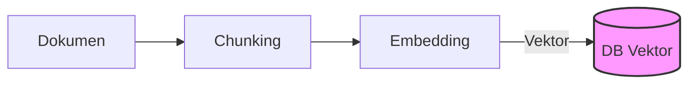
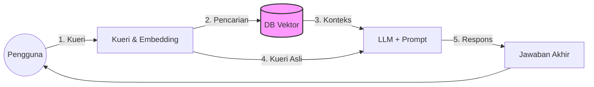
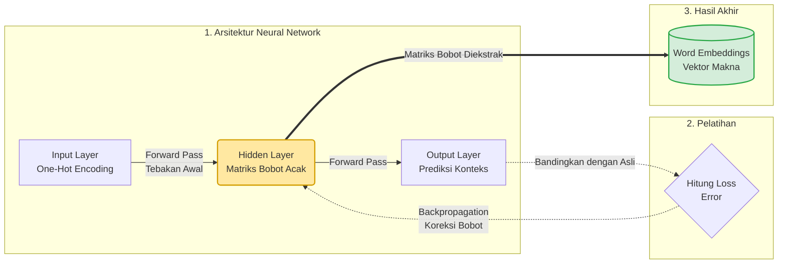

---
# try also 'default' to start simple
theme: seriph
# random image from a curated Unsplash collection by Anthony
# like them? see https://unsplash.com/collections/94734566/slidev
background: https://cover.sli.dev
# some information about your slides (markdown enabled)
title: Dasar Teori RAG
info: |
  ## Slidev Starter Template
  Presentation slides for developers.

  Learn more at [Sli.dev](https://sli.dev)
# apply UnoCSS classes to the current slide
class: text-center
# https://sli.dev/features/drawing
drawings:
  persist: false
# slide transition: https://sli.dev/guide/animations.html#slide-transitions
transition: slide-left
# enable Comark Syntax: https://comark.dev/syntax/markdown
comark: true
# duration of the presentation
duration: 35min
---

# Konsep Dasar RAG

Benny L.E.P 063251008

  Press Space for next page <carbon:arrow-right />

  <button @click="$slidev.nav.openInEditor()" title="Open in Editor" class="slidev-icon-btn">
    <carbon:edit />
  </button>
  <a href="https://github.com/slidevjs/slidev" target="_blank" class="slidev-icon-btn">
    <carbon:logo-github />
  </a>

<!--
The last comment block of each slide will be treated as slide notes. It will be visible and editable in Presenter Mode along with the slide. [Read more in the docs](https://sli.dev/guide/syntax.html#notes)
-->

---
transition: fade-out
---

# Pengertian RAG?

RAG adalah singkatan dari Retrieval-Augmented Generation (RAG)

- Retrieval (Pengambilan): Saat pengguna mengajukan pertanyaan, pertanyaan tersebut diubah menjadi vector embedding dan dicocokkan dengan dokumen yang ada di dalam database vektor menggunakan pencarian semantik untuk mencari makna yang mirip

- Augmentation (Peningkatan): Data atau dokumen relevan yang berhasil ditarik dari database kemudian disuntikkan bersama dengan pertanyaan asli pengguna untuk membentuk sebuah prompt yang baru dan lebih kaya

- Generation (Pembuatan): Prompt yang sudah diperkaya dengan fakta pendukung tersebut akhirnya diberikan kepada Large Language Model (LLM), sehingga AI bisa memberikan jawaban berdasarkan bukti atau konteks spesifik tersebut, bukan sekadar menebak-nebak

---
transition: slide-left
---

# Arsitektur & Alur RAG

Alur lengkap proses *Retrieval-Augmented Generation* (RAG):

### 📂 1. Fase Ingesti Data (Offline)
Proses pencacahan dan penyimpanan dokumen secara offline.

### 🔄 2. Fase Proses RAG (Real-Time)
Alur tanya-jawab teraugmentasi secara real-time.

---
transition: slide-left
---

# Proses penyimpanan data dari text ke vektor

Proses mengubah teks bahasa manusia menjadi representasi angka (vektor) dan menyimpannya sangat erat kaitannya dengan konsep **"dimensi"** untuk menjembatani teks mentah menjadi pemahaman semantik yang mendalam.

### 📂 1. Persiapan Teks
Proses pemecahan teks menjadi potongan-potongan bermakna:

* **Pemotongan Teks (Chunking)**
  Teks dokumen asli dipecah menjadi potongan kecil (*chunks*). Agar makna/konteks tidak terputus, pemotongan ini dibuat sedikit tumpang tindih (*chunk overlap*).

### 🔢 2. Tokenisasi
Pemecahan teks menjadi token unik:

* **Tokenisasi & Token ID**
  Potongan teks dipecah lagi menjadi unit dasar bernama *token* (kata/karakter), yang diberi nomor identitas unik (*token ID*). Pada tahap ini, angka-angka tersebut murni pengenal dasar dan belum memiliki makna semantik.

---
transition: slide-left
---

# Membangun Vektor & Dimensi Semantik

Di tahap inilah teks benar-benar diubah menjadi representasi makna matematis yang mendalam.

### 🧠 Proses Embedding
Transformasi kata ke dalam matematika:

* Token-token dilewatkan ke dalam **Embedding Model** (model AI khusus).
* Diproses melalui beberapa lapisan (*layers*) untuk memahami konteks dan makna keseluruhan kalimat.
* Menghasilkan **vector embedding** yaitu deretan angka padat (*dense vector*).

### 📐 Peran Dimensi & Kedalaman
Representasi abstrak dari fitur bahasa:

* Posisi setiap angka di dalam vektor disebut sebagai **dimensi**.
* Setiap dimensi mewakili sebuah "fitur" abstrak teks (misal: formalitas kata, topik, atau sentimen).
* Membutuhkan **ratusan hingga ribuan dimensi** (misalnya 384 atau 1.536 dimensi) untuk merepresentasikan makna teks secara utuh.

---
transition: slide-left
---

# Penyimpanan & Pengindeksan Vektor

Setelah teks diubah menjadi vektor berdimensi tinggi, data harus disimpan secara efisien agar dapat dicari dengan cepat.

### 💾 1. Penyimpanan Data
Menyimpan vektor beserta konteks aslinya:

* Vektor berdimensi tinggi disimpan bersama teks aslinya (*chunks*) dan metadata terkait (seperti judul atau halaman).
* Penyimpanan teks asli sangat krusial agar database dapat mengembalikan teks asli yang terbaca kepada pengguna saat pencarian berhasil.

### ⚡ 2. Pengindeksan & Kecepatan
Optimalisasi pencarian kemiripan makna:

* Mencocokkan kueri dengan jutaan vektor berdimensi tinggi satu per satu akan memakan waktu lama.
* Database menggunakan indeks khusus seperti algoritma **Approximate Nearest Neighbor (ANN)** untuk mengelompokkan vektor yang berdekatan.
* Menjadikan pencarian kemiripan semantik sangat instan dan cepat.

---
transition: slide-left
---

# Word Embedding: Pengantar & Urgensi

Teknik dasar dalam NLP untuk merepresentasikan kata menjadi vektor angka kontinu padat (*dense vectors*).

### ❓ Apa itu Word Embedding?
* **Representasi Vektor**
  Teks diubah menjadi koordinat angka padat di dalam sebuah ruang vektor kontinu.
* **Menangkap Konteks**
  Tujuan utama teknik ini adalah untuk memetakan hubungan semantik dan informasi konteks antar kata secara matematis.

### 💡 Mengapa Kita Membutuhkannya?
* **Kebutuhan Numerik Model**
  Jaringan saraf dan model ML tidak bisa membaca teks mentah secara langsung; mereka membutuhkan input angka (*numbers*).
* **Mengatasi Metode Lama**
  *One-hot encoding* lama sangat boros memori (mayoritas nol) dan menganggap semua kata sama sekali berbeda tanpa relasi makna (misal: "baik" vs "hebat" dianggap sejauh "baik" vs "kucing").

---
transition: slide-left
---

# Word Embedding: Mekanisme & Cara Kerja

Di dalam ruang vektor, kata-kata yang memiliki makna serupa akan secara otomatis diposisikan saling berdekatan.

### 📍 Kedekatan Semantik
* **Jarak & Arah Vektor**
  Jarak geometris dan arah antar vektor secara matematis menunjukkan tingkat kemiripan makna (*Semantic Similarity*).
* **Posisi Berdekatan**
  Melalui pelatihan korpus besar, model meletakkan kata dengan konteks mirip (seperti "anjing" dan "kucing") di posisi yang berdekatan.

### 🧮 Aritmatika Vektor
* **Operasi Matematika Kata**
  Karena direpresentasikan sebagai angka koordinat, kita bisa melakukan penjumlahan dan pengurangan untuk menguji relasi makna.
* **Contoh Klasik**
  Mengurangi karakteristik gender pria dari raja dan menambahkan karakteristik wanita menghasilkan ratu:
  
  $$\text{King} - \text{Man} + \text{Woman} \approx \text{Queen}$$

---
transition: slide-left
---

# Model Word2Vec & Arsitekturnya

Model populer dari Google (2013) yang menggunakan jaringan saraf tiruan sederhana (*shallow neural network*) untuk melatih representasi kata secara efisien dari korpus besar.

### 🔄 Dua Arsitektur Utama
* **Continuous Bag of Words (CBOW)**
  Memprediksi kata target (kata tengah) berdasarkan kata konteks di sekelilingnya.
  *Contoh:* Memprediksi `[itu]` dari kata `[Troll 2]` dan `[hebat]`.
* **Skip-gram**
  Kebalikan CBOW. Menggunakan satu kata target (tengah) untuk memprediksi konteks di sekitarnya.
  *Contoh:* Memprediksi `[Troll 2]` dan `[hebat]` dari kata `[itu]`.

### ⚡ Optimasi: Negative Sampling
* **Tantangan Komputasi**
  Melatih jutaan kata berarti memperbarui ratusan juta bobot parameter di setiap iterasi, yang memicu latensi tinggi.
* **Negative Sampling**
  Model memilih secara acak sekelompok kecil kata negatif ("yang tidak ingin diprediksi") untuk diperbarui bobotnya dan mengabaikan sisa jaringan lainnya. Hal ini membuat proses pelatihan Word2Vec menjadi sangat cepat dan efisien.

---
transition: slide-left
---

# Keterhubungan: Neural Network & Backpropagation

Fondasi utama bagaimana AI memahami bahasa. Word2Vec adalah arsitektur Jaringan Saraf Tiruan (*Neural Network*) sederhana yang dilatih menggunakan algoritma *Backpropagation*.

### 🧠 1. Arsitektur Jaringan Saraf (Neural Network)
Model Word2Vec pada dasarnya adalah *shallow neural network* (hanya memiliki satu *hidden layer*):
* **Input Layer:** Kata direpresentasikan dalam bentuk *one-hot encoding* (vektor besar berisi angka 0 dan sebuah angka 1).
* **Hidden Layer:** Jumlah neuron di sini menentukan jumlah **dimensi** vektor (misal: 300 neuron untuk dimensi 300). Awalnya diisi acak.
* **Output Layer:** Bertugas memprediksi probabilitas kata-kata konteks di sekeliling input.

### 🔄 2. Proses Belajar via Backpropagation
Jaringan saraf melatih dirinya berulang-ulang melalui tumpukan teks besar:
* **Forward Pass & Loss:** Model menebak kata konteks berdasarkan bobot acak awal, lalu menghitung selisih tingkat kesalahan (*loss/error*).
* **Backpropagation:** Algoritma merambat mundur menggunakan aturan rantai kalkulus (*chain rule*) untuk menghitung gradien. Bobot di *hidden layer* diperbarui (Gradient Descent) hingga kata dengan makna/konteks mirip memiliki bobot yang serupa.

---
transition: slide-left
---

# Keterhubungan: Lahirnya Word Embeddings

Tujuan utama melatih jaringan saraf bukanlah untuk melakukan tugas tebakan di lapisan output, melainkan untuk melahirkan vektor representasi makna.

### 🎯 3. Ekstraksi Matriks Bobot (Word Embeddings)
Setelah proses *backpropagation* selesai mengoptimalkan jaringan, lapisan output dibuang. Matriks bobot (*weight matrix*) di **hidden layer** diekstrak dan diambil sebagai **Word Embeddings** — sebuah vektor padat yang menyimpan makna semantik kata secara utuh.

