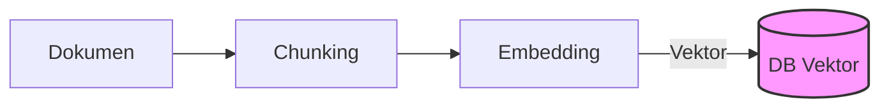
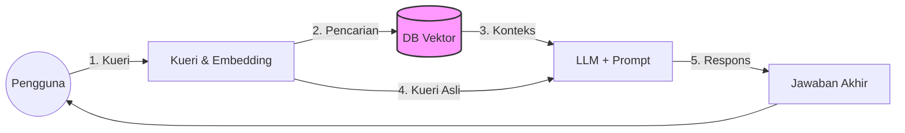
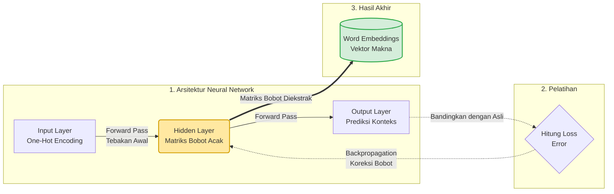
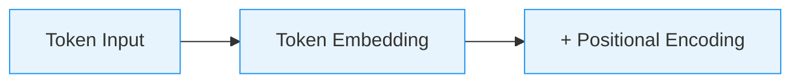
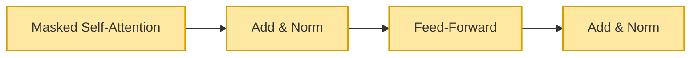
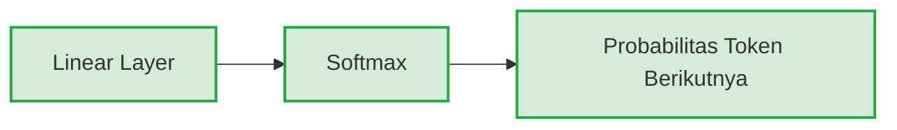
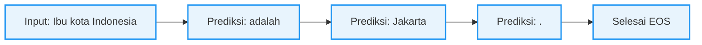
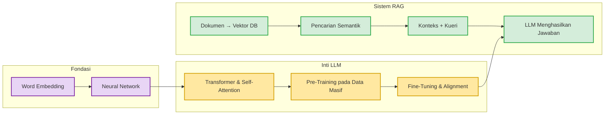

---
# try also 'default' to start simple
theme: seriph
# random image from a curated Unsplash collection by Anthony
# like them? see https://unsplash.com/collections/94734566/slidev
background: https://cover.sli.dev
# some information about your slides (markdown enabled)
title: Dasar Teori RAG
info: |
  ## Konsep Dasar RAG
  Presentasi dasar teori Retrieval-Augmented Generation.

  Oleh Benny L.E.P — 063251008
# apply UnoCSS classes to the current slide
class: text-center
# https://sli.dev/features/drawing
drawings:
  persist: false
# slide transition: https://sli.dev/guide/animations.html#slide-transitions
transition: slide-left
# enable Comark Syntax: https://comark.dev/syntax/markdown
comark: true
# duration of the presentation
duration: 35min
---

# Konsep Dasar RAG

Benny L.E.P 063251008

  Press Space for next page <carbon:arrow-right />

  <button @click="$slidev.nav.openInEditor()" title="Open in Editor" class="slidev-icon-btn">
    <carbon:edit />
  </button>
  <a href="https://github.com/slidevjs/slidev" target="_blank" class="slidev-icon-btn">
    <carbon:logo-github />
  </a>

---
transition: fade-out
---

# Pengertian RAG

**Retrieval-Augmented Generation** — teknik untuk memperkuat jawaban LLM dengan data eksternal.

### 🔍 Retrieval
*Pengambilan*

Pertanyaan pengguna diubah menjadi *vector embedding*, lalu dicocokkan dengan dokumen di **database vektor** melalui pencarian semantik.

### ⚡ Augmentation
*Peningkatan*

Dokumen relevan yang ditemukan **disuntikkan** bersama pertanyaan asli untuk membentuk prompt yang lebih kaya konteks.

### 🤖 Generation
*Pembuatan*

Prompt yang diperkaya diberikan kepada **LLM**, sehingga AI menjawab berdasarkan bukti spesifik — bukan sekadar menebak.

---
transition: slide-left
---

# Arsitektur & Alur RAG

Alur lengkap proses *Retrieval-Augmented Generation* (RAG):

### 📂 1. Fase Ingesti Data (Offline)
Proses pencacahan dan penyimpanan dokumen secara offline.

### 🔄 2. Fase Proses RAG (Real-Time)
Alur tanya-jawab teraugmentasi secara real-time.

---
transition: slide-left
---

# Proses Penyimpanan Data: Teks ke Vektor

Mengubah teks menjadi representasi angka (vektor) melalui konsep **"dimensi"** untuk menjembatani teks mentah ke pemahaman semantik.

### 📂 1. Persiapan Teks (Chunking)

* **Pemotongan Teks**
  Dokumen dipecah menjadi potongan kecil (*chunks*).
* **Chunk Overlap**
  Potongan dibuat sedikit tumpang tindih agar makna/konteks tidak terputus.

### 🔢 2. Tokenisasi

* **Tokenisasi & Token ID**
  Potongan teks dipecah menjadi unit dasar bernama *token* (kata/sub-kata), lalu diberi nomor identitas unik (*token ID*).
* **Belum Ada Makna**
  Pada tahap ini, angka-angka tersebut murni pengenal — belum memiliki makna semantik.

---
transition: slide-left
---

# Membangun Vektor & Dimensi Semantik

Di tahap inilah teks benar-benar diubah menjadi representasi makna matematis yang mendalam.

### 🧠 Proses Embedding
Transformasi kata ke dalam matematika:

* Token dilewatkan ke **Embedding Model** (model AI khusus).
* Diproses melalui beberapa lapisan (*layers*) untuk memahami konteks dan makna keseluruhan.
* Menghasilkan **vector embedding** — deretan angka padat (*dense vector*).

### 📐 Peran Dimensi & Kedalaman
Representasi abstrak dari fitur bahasa:

* Posisi setiap angka di dalam vektor disebut **dimensi**.
* Setiap dimensi mewakili "fitur" abstrak teks (misal: formalitas, topik, atau sentimen).
* Membutuhkan **ratusan hingga ribuan dimensi** (384 atau 1.536) untuk merepresentasikan makna secara utuh.

---
transition: slide-left
---

# Penyimpanan & Pengindeksan Vektor

Setelah teks diubah menjadi vektor berdimensi tinggi, data harus disimpan dan diindeks secara efisien.

### 💾 1. Penyimpanan Data
Menyimpan vektor beserta konteks aslinya:

* Vektor disimpan bersama teks asli (*chunks*) dan metadata (judul, halaman).
* Penyimpanan teks asli krusial agar database dapat mengembalikan teks yang terbaca saat pencarian berhasil.

### ⚡ 2. Pengindeksan & Kecepatan
Optimalisasi pencarian kemiripan makna:

* Mencocokkan kueri dengan jutaan vektor satu per satu terlalu lambat.
* Database menggunakan algoritma **ANN (*Approximate Nearest Neighbor*)** untuk mengelompokkan vektor berdekatan.
* Menjadikan pencarian semantik sangat cepat dan efisien.

---
transition: slide-left
---

# Word Embedding: Pengantar & Urgensi

Teknik dasar dalam NLP (*Natural Language Processing*) untuk merepresentasikan kata menjadi vektor angka padat.

### ❓ Apa itu Word Embedding?
* **Representasi Vektor**
  Teks diubah menjadi koordinat angka padat di dalam ruang vektor kontinu.
* **Menangkap Konteks**
  Memetakan hubungan semantik dan konteks antar kata secara matematis.

### 💡 Mengapa Dibutuhkan?
* **Kebutuhan Numerik**
  Jaringan saraf tidak bisa membaca teks mentah — mereka butuh input angka.
* **Mengatasi Metode Lama**
  *One-hot encoding* boros memori (mayoritas nol) dan menganggap semua kata tidak berelasi (misal: "baik" vs "hebat" sejauh "baik" vs "kucing").

---
transition: slide-left
---

# Word Embedding: Mekanisme & Cara Kerja

Kata-kata bermakna serupa otomatis diposisikan berdekatan di dalam ruang vektor.

### 📍 Kedekatan Semantik
* **Jarak & Arah Vektor**
  Jarak geometris dan arah antar vektor menunjukkan tingkat kemiripan makna (*Semantic Similarity*).
* **Posisi Berdekatan**
  Model meletakkan kata berkonteks mirip (seperti "anjing" dan "kucing") di posisi berdekatan.

### 🧮 Aritmatika Vektor
* **Operasi Matematika Kata**
  Karena direpresentasikan sebagai koordinat, kita bisa melakukan operasi untuk menguji relasi makna.
* **Contoh Klasik**
  
  $$\text{King} - \text{Man} + \text{Woman} \approx \text{Queen}$$

---
transition: slide-left
---

# Model Word2Vec & Arsitekturnya

Model dari Google (2013) menggunakan *shallow neural network* untuk melatih representasi kata dari korpus besar.

### 🔄 Dua Arsitektur Utama
* **CBOW (*Continuous Bag of Words*)**
  Memprediksi kata target berdasarkan kata konteks di sekelilingnya.
  *Contoh:* Memprediksi `[film]` dari `[itu]` dan `[hebat]`.
* **Skip-gram**
  Kebalikan CBOW — menggunakan satu kata target untuk memprediksi konteks di sekitarnya.
  *Contoh:* Memprediksi `[itu]` dan `[hebat]` dari `[film]`.

### ⚡ Optimasi: Negative Sampling
* **Tantangan Komputasi**
  Melatih jutaan kata berarti memperbarui ratusan juta bobot di setiap iterasi.
* **Solusi: Negative Sampling**
  Model memilih sekelompok kecil kata negatif secara acak untuk diperbarui, dan mengabaikan sisa jaringan. Membuat pelatihan sangat cepat dan efisien.

---
transition: slide-left
---

# Neural Network & Backpropagation

Word2Vec adalah Jaringan Saraf Tiruan sederhana yang dilatih menggunakan algoritma *Backpropagation*.

### 🧠 1. Arsitektur Neural Network
*Shallow neural network* dengan satu *hidden layer*:
* **Input Layer:** Kata dalam bentuk *one-hot encoding* (vektor 0 dan satu angka 1).
* **Hidden Layer:** Jumlah neuron = jumlah **dimensi** vektor (misal: 300).
* **Output Layer:** Memprediksi probabilitas kata konteks di sekeliling input.

### 🔄 2. Proses Backpropagation
Jaringan melatih diri secara iteratif:
* **Forward Pass & Loss:** Model menebak kata konteks, lalu menghitung tingkat kesalahan (*loss*).
* **Backpropagation:** Algoritma merambat mundur menggunakan *chain rule* untuk menghitung gradien. Bobot di *hidden layer* diperbarui (*Gradient Descent*) hingga kata bermakna mirip memiliki bobot serupa.

---
transition: slide-left
---

# Kapan Pelatihan Backpropagation Selesai?

Model tidak dilatih tanpa batas — ada kriteria berhenti yang jelas. **Epoch** = satu kali putaran penuh memproses seluruh dataset pelatihan.

### 📉 Kriteria Berhenti (1)
* **Konvergensi Loss**
  Nilai kesalahan (*loss*) sudah sangat kecil dan tidak lagi turun signifikan antar *epoch*.
* **Jumlah Epoch Tercapai**
  Pelatihan dihentikan setelah mencapai jumlah iterasi yang ditentukan (misal: 100 epoch).

### 📉 Kriteria Berhenti (2)
* **Early Stopping**
  *Validation loss* mulai **naik** sementara *training loss* masih turun → tanda **overfitting**. Pelatihan dihentikan segera.
* **Patience**
  Loss tidak membaik selama *N* epoch berturut-turut → otomatis berhenti.

---
transition: slide-left
---

# Overfitting, Underfitting & Konteks Word2Vec

Memahami kapan model belajar cukup — atau justru terlalu banyak / terlalu sedikit.

### 🎯 Dalam Konteks Word2Vec
* Biasanya menggunakan jumlah iterasi tetap atas seluruh korpus (misal: **5–15 epoch**).
* Pelatihan selesai ketika **bobot di hidden layer sudah stabil** — kata bermakna mirip memiliki vektor berdekatan.
* Tidak menggunakan *validation set* seperti model supervised — cukup memantau konvergensi loss.

### ⚖️ Overfitting vs Underfitting
* **Overfitting:** Model terlalu "menghafal" data pelatihan → performa buruk pada data baru.
* **Underfitting:** Model belum cukup belajar → loss masih tinggi. Perlu lebih banyak epoch atau arsitektur lebih besar.
* **Titik ideal:** Model cukup belajar pola umum tanpa menghafal detail spesifik data pelatihan.

---
transition: slide-left
---

# Lahirnya Word Embeddings

Tujuan melatih jaringan saraf bukan untuk melakukan tebakan — melainkan melahirkan vektor representasi makna.

### 🎯 Ekstraksi Matriks Bobot (Word Embeddings)
Setelah *backpropagation* selesai, lapisan output dibuang. Matriks bobot di **hidden layer** diekstrak sebagai **Word Embeddings** — vektor padat berisi makna semantik.

---
transition: slide-left
---

# Embedding Matrix: Tabel Pencarian Makna

Produk akhir pelatihan Word2Vec — tabel raksasa **V × d** berisi vektor makna setiap kata.

### 📊 Struktur Matriks
* **V** = ukuran kosakata (misal 50.000), **d** = dimensi (misal 300)
* Setiap **baris** = vektor makna satu kata

| Kata | Dim 1 | Dim 2 | Dim d |
|---|---|---|---|
| kucing | 0.21 | -0.58 | 0.73 |
| anjing | 0.19 | -0.61 | 0.69 |
| mobil | -0.82 | 0.34 | -0.15 |

### 🔍 Cara Kerja Lookup

Pencarian vektor dilakukan melalui perkalian matriks:

$$\vec{e}_{\text{kucing}} = \mathbf{x}_{\text{one-hot}} \times \mathbf{W}_{V \times d}$$

One-hot (satu angka `1`) × matriks → **mengekstrak tepat satu baris** vektor embedding.

---
transition: slide-left
---

# Embedding Matrix: Statis vs Kontekstual

Matriks embedding berperan berbeda pada model klasik dan model modern.

### 🔄 Statis vs Kontekstual
* **Word2Vec:** Matriks **statis** — vektor kata tetap sama di semua konteks. Kata "bank" selalu memiliki vektor yang identik.
* **Transformer (LLM):** Matriks hanya titik awal (*learnable parameter*). Setelah lookup, vektor dimodifikasi oleh **Self-Attention** sehingga makna berubah sesuai konteks kalimat.

### 💡 Peran dalam LLM Modern
* Matriks embedding adalah **lapisan pertama** setiap LLM — mengubah token ID menjadi vektor padat.
* Ukurannya sangat besar: GPT-3 memiliki matriks **50.257 × 12.288** (~617 juta parameter hanya di embedding saja).
* Sering kali matriks yang sama dipakai ulang (*weight tying*) di lapisan output untuk memprediksi token berikutnya.

---
transition: slide-left
---

# Cara Kerja LLM: Evolusi ke Transformer

Dari jaringan saraf sederhana menuju arsitektur revolusioner yang mengubah dunia AI.

### 🔙 Keterbatasan Pendahulu
* **Word2Vec** menghasilkan vektor statis — kata "bank" selalu sama di semua konteks.
* **RNN (*Recurrent Neural Network*) & LSTM (*Long Short-Term Memory*)** mampu memproses urutan kata, tetapi lambat (sekuensial) dan sulit mengingat konteks jarak jauh.

### ⚡ Terobosan Transformer (2017)
* Diperkenalkan oleh Google: paper ***"Attention Is All You Need"***.
* Memproses **seluruh kalimat secara paralel**, jauh lebih cepat.
* Menggunakan **Self-Attention** untuk menangkap hubungan makna antar kata sejauh apa pun.
* Fondasi semua LLM modern: **GPT, Gemini, LLaMA, Claude**.

---
transition: slide-left
---

# Mekanisme Self-Attention

Inti kecerdasan LLM: setiap kata "memperhatikan" semua kata lain dalam kalimat secara bersamaan.

### 🎯 Konsep Inti
* Setiap token menghasilkan tiga vektor: **Query (Q)**, **Key (K)**, **Value (V)**.
* **Query** = "Informasi apa yang saya cari?"
* **Key** = "Informasi apa yang saya tawarkan?"
* **Value** = "Konten informasi aktual saya."

### 📐 Rumus Attention

$$\text{Attention}(Q, K, V) = \text{softmax}\!\left(\frac{QK^T}{\sqrt{d_k}}\right)\!V$$

### 💡 Contoh Intuitif
Kalimat: *"Kucing itu memakan ikan **karena ia** lapar"*

Kata **"ia"** harus merujuk ke **"kucing"**, bukan "ikan". Self-Attention menghitung skor tinggi antara "ia" → "kucing", sehingga model paham konteksnya.

### 🔀 Multi-Head Attention
* Beberapa mekanisme attention jalan **paralel** (*heads*), masing-masing fokus pada aspek berbeda (sintaksis, semantik, referensi).
* Hasilnya digabungkan untuk pemahaman lebih menyeluruh.

---
transition: slide-left
---

# Arsitektur Transformer untuk LLM

LLM modern menggunakan bagian **Decoder** dari Transformer secara bertumpuk (*stacked layers*).

**1. Pemrosesan Input** → **2. Blok Transformer (×N)** → **3. Lapisan Output**

---
transition: slide-left
---

# Tokenisasi pada LLM Modern

Teks dipecah menjadi unit dasar (*token*) menggunakan algoritma tokenisasi sub-kata sebelum masuk Transformer.

### 🔤 Byte Pair Encoding (BPE)
Algoritma tokenisasi paling populer (GPT, LLaMA):
* Dimulai dari **karakter individual**, lalu menggabungkan pasangan paling sering secara iteratif.
* Menghasilkan campuran sub-kata pendek dan kata utuh.

| Teks Asli | Token |
|---|---|
| `"pembelajaran"` | `["pembel", "ajaran"]` |
| `"the"` | `["the"]` |
| `"unhappiness"` | `["un", "happiness"]` |

### 🎯 Mengapa Sub-Kata?
* **Efisien**: Kosakata terbatas (32K–100K) tetapi bisa merepresentasikan kata apa pun.
* **Kata baru**: Dipecah menjadi sub-kata yang dikenali.
* **Multibahasa**: Satu tokenizer untuk banyak bahasa.

### 🔢 Positional Encoding
* Transformer memproses paralel → tidak tahu urutan kata.
* **Positional Encoding** menyuntikkan informasi posisi ke setiap token embedding.
* Menggunakan fungsi sinusoidal atau embedding posisi yang dipelajari.

---
transition: slide-left
---

# Pelatihan LLM: Pre-Training & Fine-Tuning

LLM dilatih dalam dua fase besar yang membutuhkan sumber daya komputasi luar biasa.

### 📚 Fase 1: Pre-Training
Melatih model dari nol pada data skala masif:
* **Tugas:** *Next Token Prediction* — prediksi token berikutnya dari konteks.
* **Data:** Triliunan token dari buku, web, kode, Wikipedia.
* **Komputasi:** Ribuan GPU, berminggu-minggu hingga berbulan-bulan.
* **Hasil:** *Base Model* yang memahami bahasa, logika, dan fakta umum.

### 🎯 Fase 2: Fine-Tuning & Alignment
Menyetel model agar berguna, aman, dan patuh instruksi:

* **SFT (*Supervised Fine-Tuning*)**
  Melatih ulang dengan pasangan instruksi-jawaban berkualitas tinggi buatan manusia.

* **RLHF (*Reinforcement Learning from Human Feedback*)**
  Manusia menilai jawaban, lalu model dioptimasi agar menghasilkan respons yang lebih disukai.

* **Hasil:** Model yang mampu berdialog, mengikuti instruksi, dan menolak permintaan berbahaya.

---
transition: slide-left
---

# Cara LLM Menghasilkan Teks (Inferensi)

LLM menghasilkan teks secara **autoregresif** — memprediksi **satu token per langkah**, lalu menggunakannya sebagai input berikutnya.

### 🔄 Proses Autoregresif

Setiap langkah:
1. Seluruh konteks masuk ke Transformer
2. Model menghitung **distribusi probabilitas** atas kosakata
3. **Satu token** dipilih berdasarkan strategi sampling
4. Token ditambahkan ke konteks, ulangi

### 🎲 Strategi Pemilihan Token
* **Greedy:** Selalu pilih probabilitas tertinggi. Cepat, tapi monoton.
* **Temperature:** Nilai rendah → deterministik, tinggi → kreatif.
* **Top-k:** Pertimbangkan hanya *k* token teratas.
* **Top-p (Nucleus):** Kumpulan token terkecil yang totalnya mencapai ambang *p*.

$$P_{\text{adjusted}}(x_i) = \frac{\exp(z_i / T)}{\sum_j \exp(z_j / T)}$$

*T = temperature, z = logits*

---
transition: slide-left
---

# Keterbatasan LLM & Mengapa RAG Diperlukan

Meskipun canggih, LLM memiliki keterbatasan fundamental yang menjadi motivasi utama RAG.

### ⚠️ Keterbatasan Utama LLM
* **Halusinasi (*Hallucination*)**
  Jawaban terdengar meyakinkan tetapi bisa sepenuhnya salah — karena hanya prediksi statistik.

* **Batas Pengetahuan (*Knowledge Cutoff*)**
  Pengetahuan berhenti pada tanggal pelatihan terakhir. Tidak tahu peristiwa terkini.

* **Tanpa Sumber Referensi**
  LLM murni tidak bisa mengutip dokumen sumber, sehingga sulit diverifikasi.

### ✅ RAG sebagai Solusi
* **Grounding dengan Fakta**
  Dokumen nyata disuntikkan ke prompt — jawaban **berbasis bukti**.

* **Pengetahuan Terkini**
  Database vektor diperbarui tanpa melatih ulang model.

* **Transparansi & Verifikasi**
  Jawaban bisa dilacak ke dokumen sumber aslinya.

* **Domain-Specific**
  LLM menjawab tentang data internal organisasi tanpa *fine-tuning*.

---
transition: slide-left
layout: center
class: text-center
---

# Ringkasan: Dari Teks ke Jawaban Cerdas

**Word Embedding** → **Neural Network** → **Transformer** → **LLM** → **RAG**

Setiap konsep membangun di atas fondasi sebelumnya untuk menciptakan sistem AI yang cerdas, akurat, dan dapat dipercaya.

